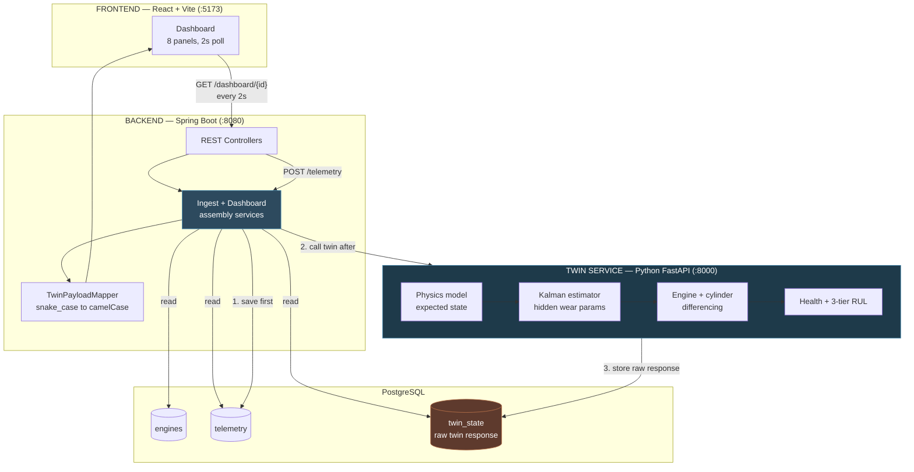

# ATLAS — Architecture

## System Overview

ATLAS is three independent services. Each one can be understood, run, and
tested on its own — the backend never breaks if the twin is down, and the
frontend never breaks if the backend is down.

## The three services

| Service | Port | Role | Owns |
|---|---|---|---|
| **uav-frontend** | 5173 | Operator dashboard | Rendering only. No business logic. |
| **uav-backend** | 8080 | Persistence + orchestration | Every DB write. Every call out to the twin. |
| **uav-twin** | 8000 | Physics + AI | Expected state, parameter estimation, health, RUL. No persistence. |

## Why the twin has no database of its own

The twin is stateless per request — it receives telemetry, computes a
result, returns it. The backend persists that result as one JSONB blob in
`twin_state.raw_response`. This is a deliberate choice: there is exactly
one place that defines what the twin's output looks like (the Python
service itself), instead of two schemas — one in Python, one in Java —
that can silently drift apart from each other over time.

## Data flow: one telemetry frame, start to finish

1. **`POST /api/v1/telemetry`** arrives at the backend with one reading
   (RPM, temperatures, pressures, per-cylinder EGT/CHT, ambient conditions).
2. The backend **saves it to Postgres first**, before doing anything else.
   This ordering is not incidental — telemetry is irreplaceable, and the
   twin's analysis is always recomputable later from stored telemetry. If
   step 3 fails, step 2 has already succeeded.
3. The backend looks up the **paired engine's latest reading** (same
   airframe, other engine position) and sends both, plus ambient
   conditions, to the twin's `/twin/step` endpoint.
4. The twin computes:
   - **Expected state** — what the physics model says these readings
     should be, given the current operating point and ambient conditions
   - **Residual** — measured minus expected, per channel
   - **Updated parameter estimates** — via a Kalman filter, tracking
     hidden wear variables like volumetric efficiency and cooling
     effectiveness
   - **Engine-to-engine and cylinder-to-cylinder deltas** — the
     differencing that separates real degradation from ambient noise
     with no environmental model required
   - **Anomaly score, health index, three-tier RUL, and ranked fault
     hypotheses**
5. The backend stores this entire response as-is in `twin_state`, and
   returns a small acknowledgment to whoever sent the telemetry.
6. **If the twin is unreachable at step 3**, the backend catches it,
   logs it, and returns `twinAvailable: false` — the telemetry from step
   2 is already safely stored either way.

## Why twin-engine differencing works without an environmental model

Two engines on the same airframe sit in the same air mass, at the same
altitude, at the same instant. Ambient temperature, air pressure, and
airspeed are identical for both. So if one engine's readings drift from
expected and the other's don't, the cause cannot be the weather — weather
is common to both. This is the reasoning the differencing step encodes,
and it requires no model of the environment at all, only a second engine
to compare against.

The same logic applies one level down: all four cylinders in one engine
share the same coolant, oil supply, and fuel, so a reading that diverges
on one cylinder alone is local to that cylinder, not a whole-engine or
environmental effect.

## Why the dashboard makes one call, not eight

The frontend has 8 panels but issues a single `GET
/api/v1/dashboard/{engineId}` every 2 seconds. The backend assembles
telemetry, twin state, health, RUL, and diagnosis into one response. This
means a live demo either shows a complete, consistent snapshot or shows
nothing — never a half-updated dashboard where some panels are a poll
cycle ahead of others.

## Data provenance

Every response, at every layer, carries `dataSource: SIMULATED`. This is
not a disclaimer added at the end — it's a field on the actual data
objects, and the frontend renders it as a persistent badge on every panel.
No DRDO dataset exists for this problem statement, and no team working on
it has real aero-piston failure data; this is stated plainly rather than
implied away.

## What is out of scope, on purpose

- **Authentication / multi-tenancy** — not needed for a single-operator
  prototype demo.
- **WebSockets** — 2-second polling is imperceptible to a human operator
  and has far fewer failure modes live than a persistent connection.
- **Vibration-based bearing diagnostics** — architecturally supported by
  the twin's interface, but not implemented, because no accelerometer
  data exists to validate it against.
- **Docker / Kubernetes** — three processes on one machine do not need
  container orchestration; it would add setup risk with no benefit at
  this scale.
